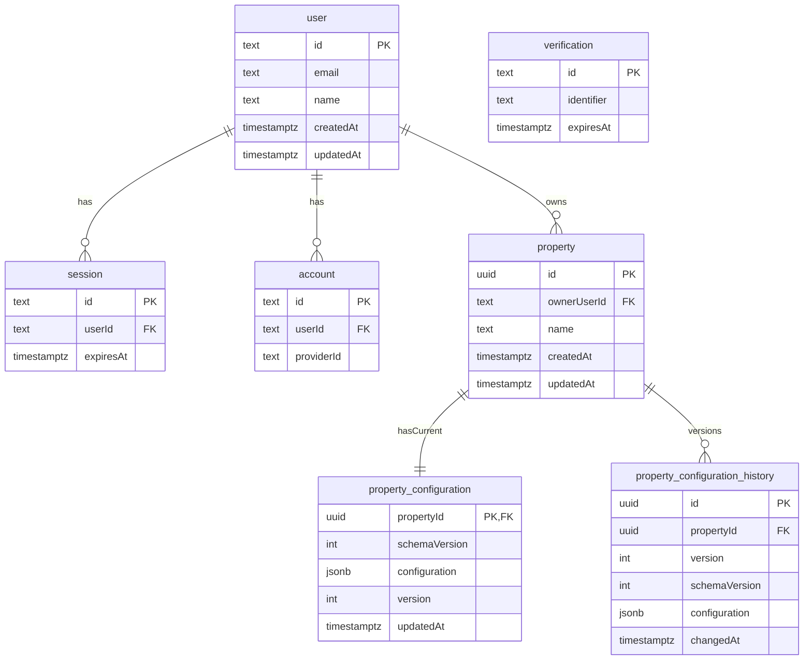

## Scope

- **Add Postgres on Neon** and connect from your Next.js (Node runtime) app.
- **Use Drizzle ORM + drizzle-kit** for schema + migrations.
- **Use Better Auth** with the Drizzle adapter (Postgres provider) and generate its required tables.
- **Add domain tables**: `property` (owned by `user`), `property_configuration` (current JSONB config), and `property_configuration_history` (versioned snapshots).
  - Property configuration is validated with **Zod** using a **schemaVersion** field (discriminated union).

## Key files to add/change

- **DB + Drizzle**
  - [`drizzle.config.ts`](/Users/tommaso/personal-projects/r-u-experienced-builder/drizzle.config.ts) (drizzle-kit config)
  - [`lib/db.ts`](/Users/tommaso/personal-projects/r-u-experienced-builder/lib/db.ts) (Neon + Drizzle client)
  - [`db/schema/auth.ts`](/Users/tommaso/personal-projects/r-u-experienced-builder/db/schema/auth.ts) (generated by Better Auth CLI)
  - [`db/schema/app.ts`](/Users/tommaso/personal-projects/r-u-experienced-builder/db/schema/app.ts) (your tables: property + configuration + history)
- **Validation**
  - [`lib/property-configuration.ts`](/Users/tommaso/personal-projects/r-u-experienced-builder/lib/property-configuration.ts) (Zod schema + inferred TypeScript type)
- **Better Auth**
  - [`lib/auth.ts`](/Users/tommaso/personal-projects/r-u-experienced-builder/lib/auth.ts) (Better Auth server instance wired to Drizzle)
  - [`lib/auth-client.ts`](/Users/tommaso/personal-projects/r-u-experienced-builder/lib/auth-client.ts) (client SDK instance)
  - `[app/api/auth/[...all]/route.ts](/Users/tommaso/personal-projects/r-u-experienced-builder/app/api/auth/[...all]/route.ts)` (mount Better Auth handler)

## Dependencies

- Add:
  - `drizzle-orm`, `drizzle-kit`
  - `@neondatabase/serverless` (Neon HTTP driver)
  - `better-auth` (and use `npx @better-auth/cli@latest ...` for schema generation)
  - `zod` (validate `property_configuration.configuration` server-side)

## Environment variables

- **Neon**
  - `DATABASE_URL` (Neon Postgres connection string; prefer pooled if you’ll run many short-lived serverless requests)
- **Better Auth**
  - `BETTER_AUTH_SECRET` (random secret)
  - `BETTER_AUTH_URL` (e.g. `http://localhost:3000` in dev; your prod URL in prod)

## Schema design

### Tables

- **Better Auth core (generated)**
  - `user` (primary identity)
  - `session` (user sessions)
  - `account` (credential/social accounts; passwords live here)
  - `verification` (tokens for email verification, reset, etc.)

- **Domain tables (custom)**
  - `property`
    - `id` uuid PK
    - `ownerUserId` text FK → `user.id`
    - `name` text (human label)
    - `createdAt`, `updatedAt` timestamps
  - `property_configuration` (current snapshot)
    - `propertyId` uuid PK + FK → `property.id` (enforces 1:1)
    - `schemaVersion` int (schema for the JSON payload; starts at 1)
    - `configuration` jsonb (current config snapshot; defaults to `{}`)
    - `version` int (monotonic, starts at 1)
    - `updatedAt` timestamp
  - `property_configuration_history`
    - `id` uuid PK
    - `propertyId` uuid FK → `property.id`
    - `version` int (unique per property)
    - `schemaVersion` int (schema for the JSON payload at that point in time)
    - `configuration` jsonb (full snapshot at that version)
    - `changedAt` timestamp

### ER diagram (Mermaid)

## Migration workflow

- **1) Generate Better Auth Drizzle schema**
  - Run `npx @better-auth/cli@latest generate --output ./db/schema/auth.ts` (or similar output path).
- **2) Add custom tables** in `db/schema/app.ts` using `drizzle-orm/pg-core` (uuid + jsonb + FK constraints + indexes).
  - Add a **unique constraint** on `(propertyId, version)`.
  - Add `schemaVersion` as **NOT NULL** on both `property_configuration` and `property_configuration_history`.
  - (Recommended) Add a **consistency check** so the JSON payload matches the column:\n    - `schemaVersion = (configuration->>'schemaVersion')::int`\n    This prevents accidental writes where the JSON says one version but the row says another.
  - Add indexes on `property.ownerUserId`, `property_configuration.propertyId` (PK already), `property_configuration_history.propertyId`, and optionally `(propertyId, changedAt)`.
- **3) Run drizzle-kit migrations**
  - Configure drizzle-kit `schema` to point directly to the concrete files (avoid barrels), e.g. `["./db/schema/auth.ts", "./db/schema/app.ts"]`.
  - `drizzle-kit generate` → creates SQL migration files.
  - `drizzle-kit migrate` → applies to Neon.

## Better Auth integration (Next.js App Router)

- Create `lib/auth.ts` with:
  - `betterAuth({ database: drizzleAdapter(db, { provider: "pg", schema: { ...generatedSchema } }) , emailAndPassword: { enabled: true } })`
- Mount handler in `[app/api/auth/[...all]/route.ts](/Users/tommaso/personal-projects/r-u-experienced-builder/app/api/auth/[...all]/route.ts)`:
  - `export const { GET, POST } = toNextJsHandler(auth)`
- Create `lib/auth-client.ts` using `createAuthClient` (React client recommended since you’re on React 19).

## Property config + history write pattern

- Provide a single server-side function (or route handler) that updates a property’s config **transactionally**:
  - validate the incoming config with the Zod schema (reject if invalid)\n    - requires `configuration.schemaVersion` and uses it to pick the correct schema
  - read current `version` from `property_configuration`
  - `nextVersion = version + 1`
  - insert into `property_configuration_history` with `version = nextVersion`, `schemaVersion`, and full `configuration` snapshot
  - update `property_configuration.configuration`, `property_configuration.schemaVersion`, `property_configuration.version`, `property_configuration.updatedAt`
  - (optionally) update `property.updatedAt` for “last touched” semantics
- On property creation:
  - insert `property`
  - validate initial config with the same Zod schema
  - insert `property_configuration` with `schemaVersion`, `version = 1`, and initial config snapshot
  - insert initial history row `version = 1` with `schemaVersion` and the same snapshot

## Property configuration validation (Zod)

- Define a Zod schema for the configuration JSON in `lib/property-configuration.ts` and export:
  - `propertyConfigurationSchema`
  - `type PropertyConfiguration = z.infer<typeof propertyConfigurationSchema>`
- Use the **schemaVersion approach**:\n  - define per-version schemas (e.g. `propertyConfigurationV1Schema`, `propertyConfigurationV2Schema`, ...)\n  - define `propertyConfigurationSchema = z.discriminatedUnion(\"schemaVersion\", [propertyConfigurationV1Schema, propertyConfigurationV2Schema, ...])`\n  - when you evolve config, add a new schemaVersion and (optionally) a server-side migration function `migratePropertyConfiguration(from) -> toLatest` for older versions.
- Enforce validation **at the boundaries** (create/update config endpoints/helpers), never trusting raw JSON from clients.

## Verification steps

- Confirm Better Auth endpoints respond under `/api/auth/*`.
- Run a quick migration + query to ensure:
  - creating a property inserts the initial history row
  - updating configuration increments `property_configuration.version` and adds a history row