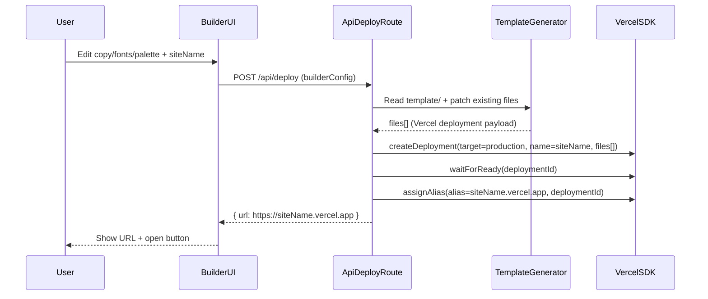

# Website builder refactor (template-driven + Vercel production deploy)

## What we’re building

- A builder UI (in the root Next app) where the user edits:
  - **Hero section copy** (kicker, headline, description, CTA labels)
  - **Font pairing** (preset pairs + advanced pick of sans/serif)
  - **Color palette** (preset palettes + optional fine-tuning)
- On **Deploy**, the builder generates a **modified copy of the `template/` app in-memory**, sends it to Vercel via the existing SDK wrapper in [`/Users/tommaso/personal-projects/r-u-experienced-builder/lib/vercel.ts`](/Users/tommaso/personal-projects/r-u-experienced-builder/lib/vercel.ts), waits for readiness, assigns the stable alias `https://<siteName>.vercel.app`, and returns that URL.

## High-level architecture

## Template refactor (minimal) + direct patching strategy

Constraint: **no extra files** and **no font preloading**. So we will patch the existing template files directly at deploy time (in-memory), then send the patched sources to Vercel as `files[]`.

### Files we will rewrite per deployment

- **Hero copy**: [`/Users/tommaso/personal-projects/r-u-experienced-builder/template/components/hero-section.tsx`](/Users/tommaso/personal-projects/r-u-experienced-builder/template/components/hero-section.tsx)\n+  - Replace the literal strings for kicker/headline/paragraph/CTAs.\n+  - To make this robust, we can optionally add small inline markers (comments) in this existing file (still no new files) so the patcher can do deterministic replacements.\n+
- **Fonts (no preloading)**: [`/Users/tommaso/personal-projects/r-u-experienced-builder/template/app/layout.tsx`](/Users/tommaso/personal-projects/r-u-experienced-builder/template/app/layout.tsx)\n+  - Rewrite the `next/font/google` import + font declarations to include **only the selected sans/serif fonts**.\n+  - Keep the same CSS variable names (`--font-sans`, `--font-serif`) so the rest of the template keeps working.\n+
- **Color palette**: [`/Users/tommaso/personal-projects/r-u-experienced-builder/template/app/globals.css`](/Users/tommaso/personal-projects/r-u-experienced-builder/template/app/globals.css)\n+  - Rewrite a targeted subset of CSS custom properties under `:root` and `.dark` (at minimum: `--background`, `--foreground`, `--primary`, `--primary-foreground`, `--secondary`, `--secondary-foreground`, `--muted`, `--muted-foreground`, `--accent`, `--accent-foreground`, `--border`, `--ring`).\n+  - For “hybrid” UX, presets map to known OKLCH values; fine-tuning allows user overrides for a subset (e.g. primary/accent/background).\n+

This keeps the template unchanged on disk during runtime; the modifications only exist in the deployment payload.

## Builder app changes (root app)

- **Replace** the current demo page with a builder UI:
  - [`/Users/tommaso/personal-projects/r-u-experienced-builder/app/page.tsx`](/Users/tommaso/personal-projects/r-u-experienced-builder/app/page.tsx)
- Add a builder feature folder (suggested):
  - [`/Users/tommaso/personal-projects/r-u-experienced-builder/components/builder/`](/Users/tommaso/personal-projects/r-u-experienced-builder/components/builder/)
  - Includes a form, presets data, and a lightweight preview panel.
- Deploy flow UX:
  - Site name/slug input (validated, slugified)
  - “Deploy” button
  - Loading state + error handling
  - Result card with the returned URL

## Server-side deploy endpoint

- **Create** Next route handler:
  - [`/Users/tommaso/personal-projects/r-u-experienced-builder/app/api/deploy/route.ts`](/Users/tommaso/personal-projects/r-u-experienced-builder/app/api/deploy/route.ts)
  - `runtime = 'nodejs'` (needs `fs`)
  - Validates request body (manual or `zod`), then:
    - Reads the `template/` directory
    - Builds Vercel `files[]` payload (including binary assets from `template/public/`)
    - Patches **existing template files** in-memory before creating the deployment payload:
      - `template/components/hero-section.tsx` (copy)
      - `template/app/layout.tsx` (fonts; no preloading)
      - `template/app/globals.css` (palette variables)
    - Calls Vercel deploy

## Vercel SDK wrapper upgrades

- Expand [`/Users/tommaso/personal-projects/r-u-experienced-builder/lib/vercel.ts`](/Users/tommaso/personal-projects/r-u-experienced-builder/lib/vercel.ts) to support:
  - `createDeployment({ name, files, target: 'production', teamId? })`
  - `waitForDeploymentReady({ deploymentId })` polling `getDeployment`
  - `assignAlias({ deploymentId, alias })` to create `https://<siteName>.vercel.app`
  - Optional `teamId`/`slug` support via env vars if needed later

## Env vars + local setup

- `VERCEL_TOKEN` required (already assumed by `lib/vercel.ts`).
- Optional (future-proof): `VERCEL_TEAM_ID` if deploying under a team.

## Verification

- Local:
  - Run the builder, deploy a sample site name, confirm returned URL is reachable.
- Safety:
  - Confirm the deploy payload includes `package.json`, lockfile, `app/`, `components/`, `public/`.